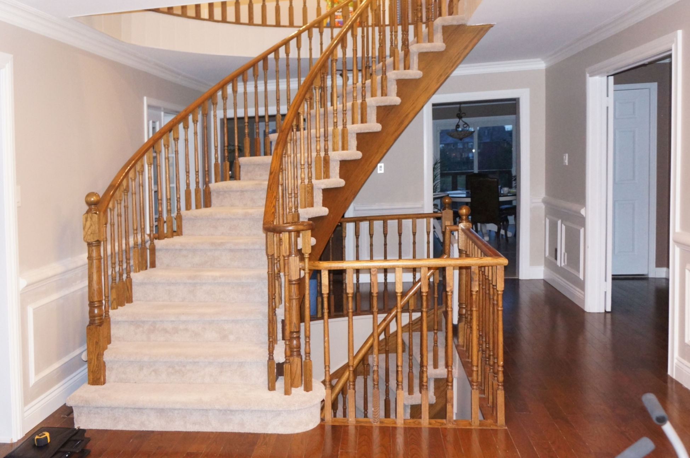

The best stair-renovation method starts with what is already in the house. Two staircases can look equally dated but require very different work once carpet, old coatings or damaged nosings are inspected.

Based on the staircase renovation projects we see across the GTA, the decision usually comes down to three questions: Is the existing tread material suitable to keep? Can the visible damage be corrected? Will the finished stair coordinate with the surrounding floors and railing?

## When stair refinishing is the better choice

Refinishing preserves the existing hardwood treads. It makes sense when the wood is structurally sound, thick enough for the required preparation and free of damage that would remain obvious after sanding.

A refinishing scope can include repairs, controlled sanding, stain samples, colour adjustment and finish coats. White risers or stringers and a new railing can be coordinated with the tread work, but they are separate parts of the scope.

Refinishing is often the right direction when:

- the stairs are already hardwood rather than construction-grade lumber;
- wear, scratches or an old stain are mainly surface issues;
- the nosings and tread edges can be repaired cleanly;
- the existing shape and proportions should remain;
- a stain sample can create a practical relationship with the adjacent flooring.

Matching a floor does not mean choosing a stain name from a chart. Wood species, age, grain, previous coatings, light and floor wear all affect the result. Samples on representative wood are more useful than assuming two surfaces will accept colour in the same way.

## When hardwood tread caps make more sense

Tread caps create a new hardwood surface over a suitable existing stair structure. They are commonly considered after carpet removal or where the original treads are not a good candidate for refinishing.

The existing staircase still matters. Carpet, staples and old nosing details must be removed or addressed, and the underlying treads, risers and stringers have to be assessed before the final method is confirmed.

Tread caps are often the better direction when:

- the staircase was built to be carpeted;
- the exposed tread material is unsuitable for a finished appearance;
- wear, patches or mismatched repairs would remain visible after sanding;
- a new hardwood nosing and consistent tread surface are needed;
- the design calls for white risers with a new wood tread finish.

The before photo above and the finished project shown at the top of this guide are the same staircase. The renovation changed more than the walking surface: the tread finish, risers and railing were coordinated so the stair related to the rest of the interior.

## What does not change between the two methods

Neither method should be priced by looking at the tread surface alone. Curved treads, winders, open sides, landings, custom nosings and railing connections all affect the work.

The surrounding components also determine how finished the result will look:

- **Risers and stringers:** Existing paint, gaps and surface damage may need preparation and correction.
- **Landings:** The new stair finish needs a deliberate transition into the landing or surrounding floor.
- **Posts and handrails:** New railing work must be coordinated with tread and nosing dimensions.
- **Balusters and upper guards:** Spacing, connections and the visual rhythm continue beyond the main flight.
- **Squeaks and movement:** Some issues can be reduced during the renovation, but the cause and available access matter.

This is why the [main stair renovation page](/services/stairs) treats refinishing, tread caps and railing work as related decisions rather than isolated products.

## A practical way to compare the options

Start by asking a contractor to identify the existing tread material and explain what can remain. A useful assessment should separate facts from assumptions, especially when the stairs are still covered by carpet.

For a refinishing proposal, look for a clear description of sanding, repairs, stain samples, finish coats and any paint work. For tread caps, look for the tread and nosing material, preparation of the existing stair, riser and stringer treatment, landing transitions and railing coordination.

Do not compare one quote labelled “refinishing” with another labelled “capping” as if the words describe identical outcomes. Compare the components, preparation, finish expectations and exclusions.

## What photos help before an assessment

Useful staircase photos include:

1. a full view from the bottom;
2. a full view from the top;
3. a side view showing the stringer and nosings;
4. each landing and upper guard;
5. posts, handrails and balusters;
6. damaged, loose or squeaking areas;
7. the floor or finish the staircase should coordinate with.

Photos can help establish an initial direction, but they cannot always reveal the tread material beneath carpet or the condition of hidden connections.

## The short answer

Choose [stair refinishing](/services/stairs/refinishing) when suitable hardwood is already there and worth preserving. Choose [hardwood tread caps](/services/stairs/tread-caps) when the existing tread surface is not suitable for a finished stair or when carpeted stairs need a consistent new hardwood surface.

In both cases, the best result comes from planning the complete staircase—treads, risers, stringers, landings and railing—before finish work begins.
