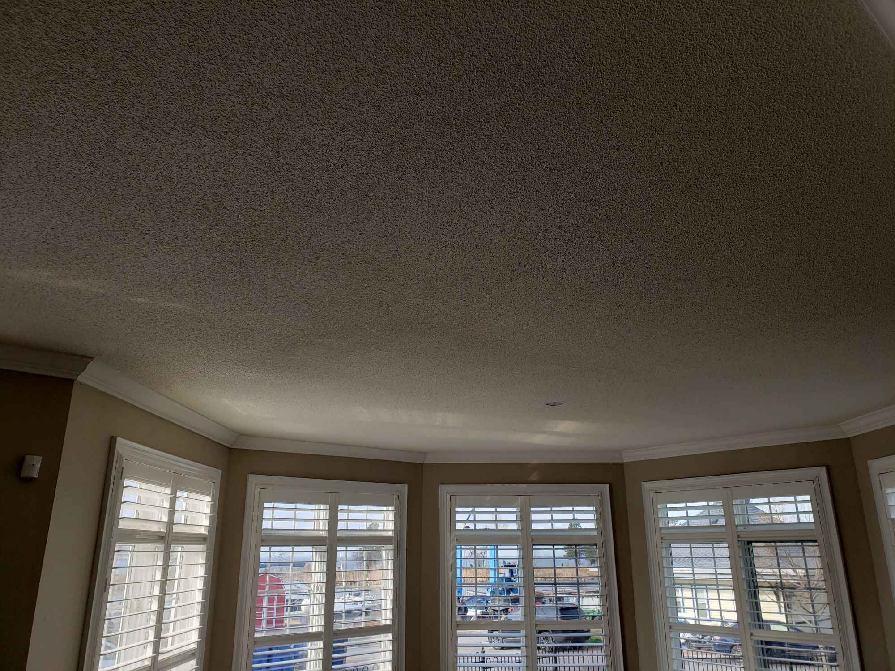

Popcorn texture is only the visible top layer. Once it is removed, the condition of the ceiling underneath determines most of the finishing work.

That is why two quotes that both say “popcorn ceiling removal” can describe very different results. One may stop after texture removal. Another may include the correction, skim coating, sanding, primer and paint needed to produce a ceiling that looks finished under real room lighting.

## First, the exposed ceiling is assessed

Texture can hide drywall seams, fasteners, ridges, waves, cracks and old patches. Some ceilings were never prepared to be seen as a smooth finish because the texture was always intended to conceal the surface.

After removal or controlled resurfacing, the exposed ceiling is checked for:

- visible seams and joint-compound ridges;
- scraper marks or damaged drywall paper;
- cracks and previous repairs;
- uneven transitions at bulkheads, columns and ceiling edges;
- surface movement or areas that require a broader repair;
- lighting conditions that reveal defects.

This assessment is not an optional cosmetic step. It sets the repair and skim-coating scope.

## Removal is not always simple scraping

Unpainted texture that releases cleanly may be removable by scraping after suitable preparation. Painted texture can behave differently because paint can seal the surface and change adhesion.

Depending on the paint, texture, substrate and ceiling condition, the practical method may involve removal, resurfacing or a combination of correction steps. Covering unstable material without addressing its condition is not a sound finishing plan.

If the age or history of a ceiling raises a material concern, testing should happen before scraping, sanding, drilling or cutting. A photo or the age of a house alone cannot identify a material. A positive result requires the appropriate regulated specialist before ordinary refinishing continues.

## Repairs come before the final skim

Local damage and visible joints are corrected before the ceiling receives its final surface treatment. The exact work varies, but it can include retaping a failed seam, filling scraper damage, correcting cracks or blending an old patch into the surrounding ceiling.

Recurring cracks deserve more attention than a quick surface fill. Their location, history and movement determine whether a broader correction or further review is appropriate.

## Skim coating creates the finished plane

Skim coating applies joint compound in controlled layers to correct and unify the surface. It is not automatically identical on every ceiling. Some areas may need local correction, while a ceiling with widespread waves, seams or damage may require broader skim work.

The goal is not simply to make the ceiling feel smooth by hand. The surface needs to read consistently after primer and paint, including beside windows and under ceiling lights.

Natural light is especially revealing. Low-angle daylight can show ridges and repairs that are less obvious during preparation, which is why inspection under practical lighting matters.

## Sanding is controlled, not magically absent

Ceiling refinishing involves sanding. A responsible description is dust-controlled, not dust-free.

Protection can include covering or relocating furniture, protecting floors, isolating openings, planning circulation and using HEPA source extraction. The setup depends on the number of rooms, ceiling height, access and whether the home is occupied.

Controlled sanding and cleanup reduce migration, but the work still needs a realistic containment and protection plan.

## Primer and paint reveal the actual finish

Primer helps seal corrected surfaces and creates a consistent base for paint. It can also reveal defects that require another correction before final coating.

Ceiling paint then creates the final appearance and sheen. The written scope should say whether primer and paint are included rather than leaving the homeowner to assume that “removal” means a completely painted ceiling.

The [smooth ceiling finishing service](/services/smooth-ceiling-finishing) focuses on this finished result, while the [popcorn ceiling removal page](/services/popcorn-removal) explains the complete removal and refinishing sequence.

## Cleanup and final review

Protection is removed after the work and coatings allow it. The room is cleaned, ceiling edges and transitions are reviewed, and the finished surface is checked in the room’s normal lighting.

When a home remains occupied, the sequence should also identify when a room can be accessed and when furniture or fixtures can return to place.

## What a complete written scope should say

Before comparing quotes, look for clear answers to these questions:

1. Is the proposed method removal, resurfacing or both?
2. What protection and containment are included?
3. How are seams, cracks and surface damage handled?
4. Is skim coating local or room-wide where required?
5. Are controlled sanding and light inspection included?
6. Are primer and ceiling paint included?
7. What cleanup and final review are included?
8. What conditions could change the scope after the texture is exposed?

The useful comparison is not the removal price alone. It is the complete path from textured ceiling to corrected, primed and painted surface.
