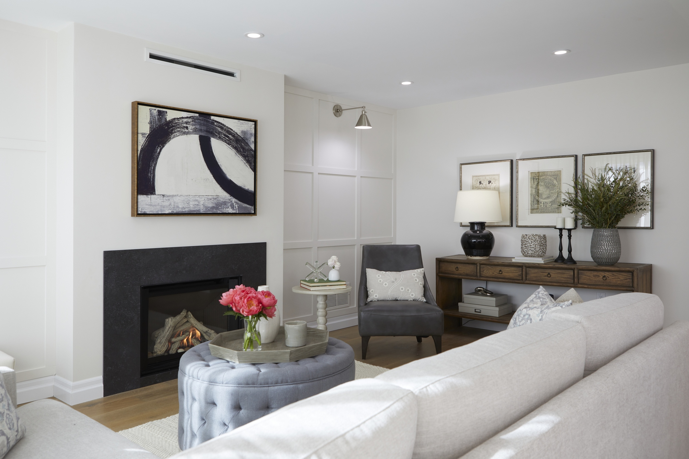
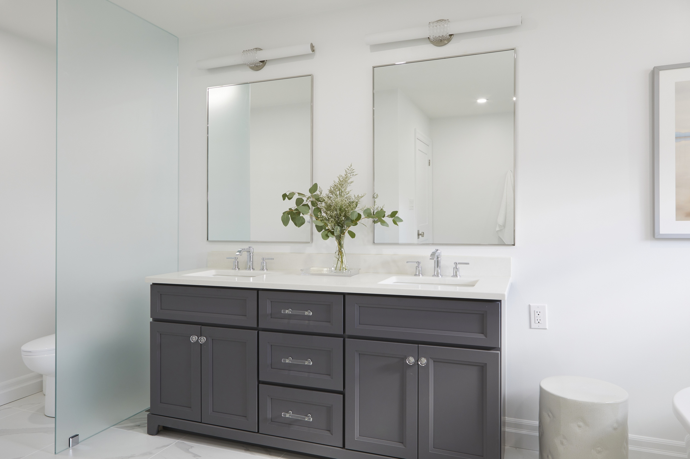
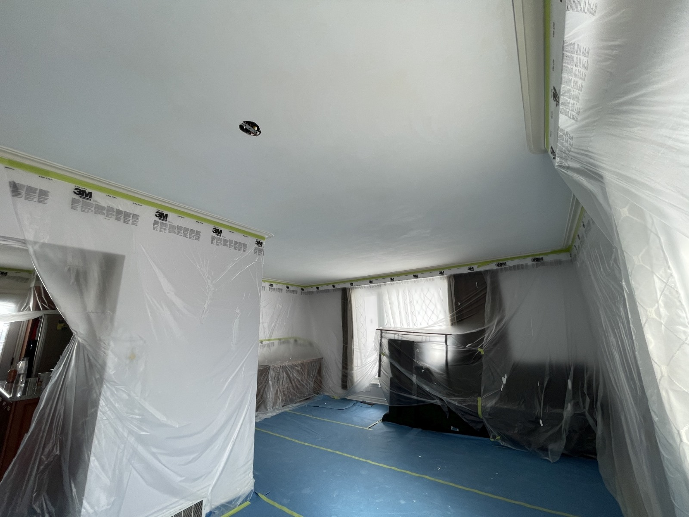

import Hero from '~/components/Hero.astro'
import Container from '~/components/layout/Container.astro'
import Card from '~/components/Card.astro'

<Hero
  title="Renovations designed to transform your space"
  description="We have been transforming spaces dust-free for decades."
>
  
  
  
  
</Hero>

<Container
  title="Popular services"
>
  <Card
    title="Popcorn ceiling removal"
    variant="right"
    description="Our process includes dust-free popcorn removal, skim coating and sanding the surface smooth, application of primer and paint for a perfectly flat finish.">
    
  </Card>

  <Card
    title="Stair refinishing"
    description="We transform staircases into stunning focal points that elevate your home with meticulous craftsmanship and a passion for excellence.">
    
  </Card>
</Container>
