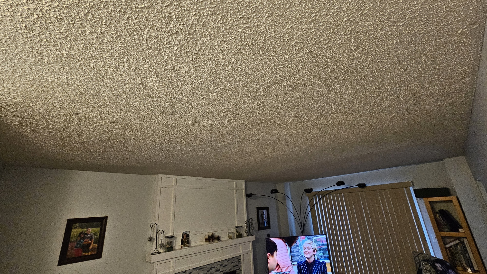
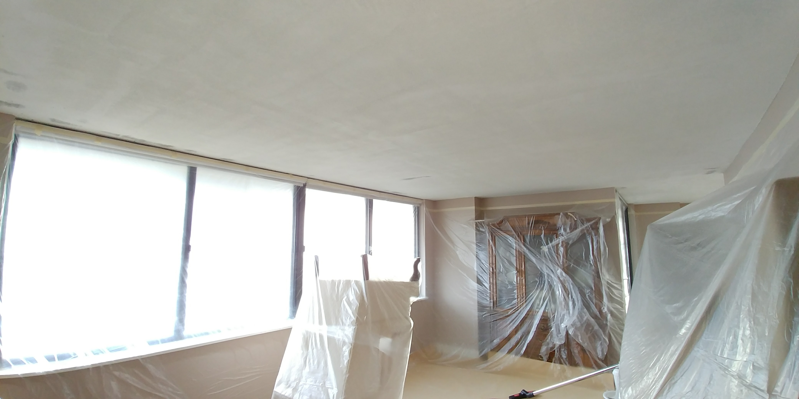

import citytv from '../../index/awards/citytv.jpg';

<Section.FullVideo
  title="Mentioned on CityTV"
  id="citytv"
  variant={Variant.Pos.Right}
  path="/videos/cityline.mp4"
  format="video/mp4"
  poster={citytv}
/>

<Section.Question
  title="Why remove popcorn ceilings?"
  id="why"
  description={`
Popcorn ceilings, were popular in the mid-20th century for their ability to hide imperfections. However, they have fallen out of favor due to their dated appearance and difficulty cleaning.
  `}
>

<Card.Question
  title="Aesthetic upgrade"
  i={1}
  description={`
Modern homes have smooth ceilings, because it makes your room feel more spacious and beautiful.
  `}
/>

<Card.Question
  title="Increased home value"
  i={2}
  description={`
Updating your ceiling improves your home’s marketability. All imperfections removed.
  `}
/>

<Card.Question
  title="Easier maintenance"
  i={3}
  description={`
Smooth ceilings are much easier to clean and maintain than textured ones.
  `}
/>

<Card.Question
  title="Potential asbestos issues"
  i={4}
  description={`
If your popcorn ceiling was installed before the 1980s, it likely has asbestos, requiring professional removal for safety.
  `}
/>

</Section.Question>

<Section.TextCarousel
  text={["Expert popcorn removal", "Kernels of design wisdom", "No scrape of popcorn left", "Ceiling texture worth savoring"]}
/>

<Section.Panel
  title="Our process"
  variant={Variant.Pos.Right}
  id="process"
>
<Card.Panel
  title="Inspection"
>
  
</Card.Panel>

<Card.Panel
  title="Removal"
>
  
</Card.Panel>

<Card.Panel
  title="Cleanup"
>
  
</Card.Panel>

</Section.Panel>

<Section.Faq
  title="Have any questions?"
  id="faq"
>

<Card.Faq
  title="How much does popcorn ceiling removal cost?"
  description={`
The cost varies depending on the size of the area and the complexity of the removal. Contact us for a free estimate!
  `}
/>

<Card.Faq
  title="How long does the process take?"
  description={`
Typically, the process can take anywhere from a few hours to a couple of days, depending on the size of the job.
  `}
/>

<Card.Faq
  title="Can I do it myself?"
  description={`
While DIY removal is possible, it can be messy and hazardous, especially if asbestos is present. We recommend hiring professionals for the best results.
  `}
/>

</Section.Faq>
