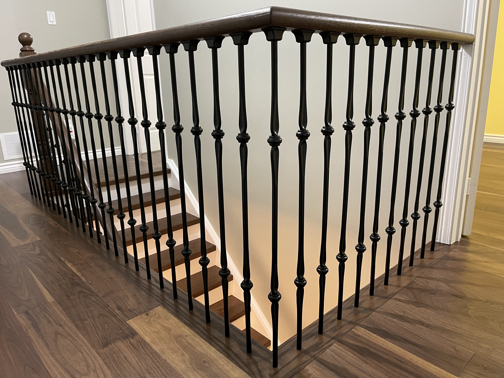

<Section.ImageCarousel
  title="We know how stairs should look"
  variant={Variant.Pos.Right}
  speed={0.4}
  id="photos"
>
  
  
  
  
  
  
  
  
  
  
  
</Section.ImageCarousel>

<Section.Question
  title="Why should we replace your stairs?"
  id="why"
  variant={Variant.Pos.Left}
  description={`
  `}
>

<Card.Question
  title="Meticulous. Beautiful. Precise."
  i={1}
  description={`
Our dedication to perfect fit and finish means every project is executed with exceptional care. If you appreciate fine craftsmanship, you’ll love the results.
  `}
/>

<Card.Question
  title="High quality materials"
  i={2}
  description={`
We use premium materials from trusted suppliers to guarantee lasting beauty and durability. With us, you can expect the best results that stand the test of time.
  `}
/>

<Card.Question
  title="Expert Installation"
  i={3}
  description={`
Nothing replaces experience. We’ve mastered the art of renovation, bringing proven expertise and confidence to every project. Excellence is our standard.
  `}
/>

<Card.Question
  title="Increase property value"
  i={4}
  description={`
By combining high-quality materials with modern safety features, we enhance both functionality and market value.
  `}
/>

</Section.Question>

<Section.Faq
  title="Have any questions?"
  id="faq"
  variant={Variant.Pos.Right}
>

<Card.Faq
  title="How long does a staircase renovation take?"
  description={`
Our projects typically take a week, depending on the complexity.
  `}
/>

<Card.Faq
  title="Can you work within my budget?"
  description={`
Absolutely. We offer tailored solutions to suit various budgets without compromising quality.
  `}
/>

</Section.Faq>

<Section.TextCarousel
  text={["Made with love", "No scrape of dust left", "Absolutely revelatory", "Expert opinions"]}
/>

<Section.Review
  title="What our clients say"
  titlePos={Variant.Pos.Left}
  id="reviews"
>

<Card.Review
  title="Violet"
  location="Markham"
  stars={5}
  description={`
Our new staircase is a showstopper! It’s the first thing everyone notices when they walk in.
  `}
/>

<Card.Review
  title="H. Archibald"
  location="Toronto"
  stars={5}
  description={`
Incredible craftsmanship and attention to detail. We couldn’t be happier.
  `}
/>

</Section.Review>
