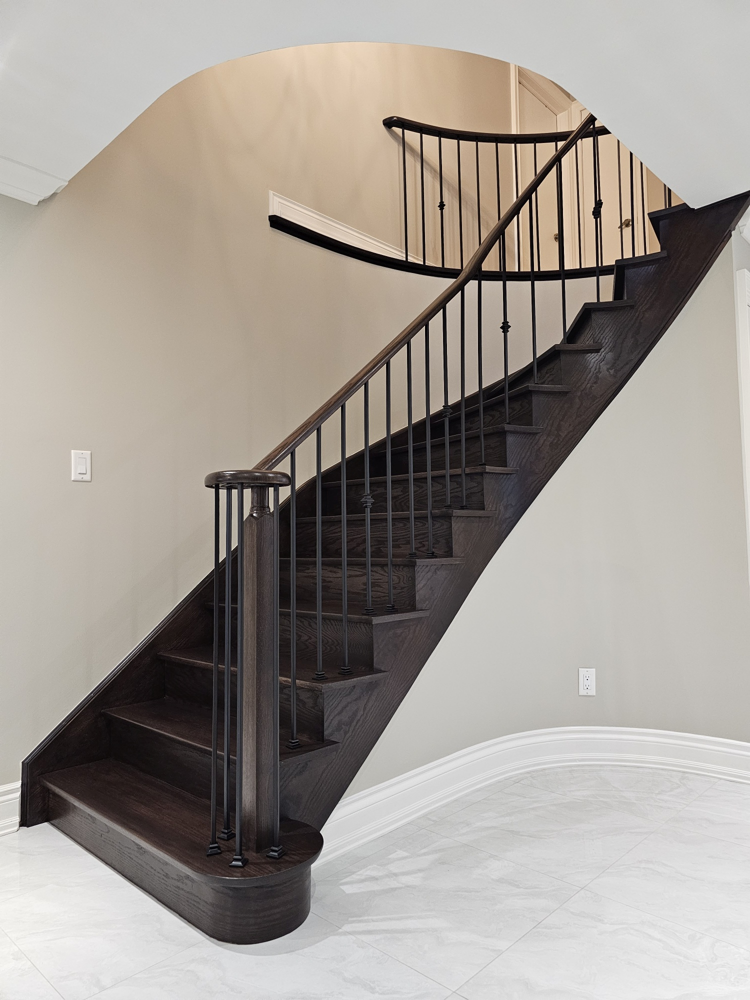

<Section.ImageCarousel
  speed={4000}
  eager
>
  
  
  
  
  
  
  
  
  
</Section.ImageCarousel>

<Section.Question
  title="Why should we replace your stairs?"
>

<Card.Question
  title="Meticulous. Beautiful. Precise."
  i={1}
>

Our dedication to perfect fit and finish means every project is executed with exceptional care. If you appreciate fine craftsmanship, you’ll love the results.

</Card.Question>

<Card.Question
  title="High quality materials"
  i={2}
>

We use premium materials from trusted suppliers to guarantee lasting beauty and durability. With us, you can expect the best results that stand the test of time.
</Card.Question>

<Card.Question
  title="Expert Installation"
  i={3}
>

Nothing replaces experience. We’ve mastered the art of renovation, bringing proven expertise and confidence to every project. Excellence is our standard.

</Card.Question>

<Card.Question
  title="Increase property value"
  i={4}
>

By combining high-quality materials with modern safety features, we enhance both functionality and market value.

</Card.Question>

</Section.Question>

<Section.Review
  title="What our clients say"
>

<Card.Review
  title="Violet"
  location="Markham"
  stars={5}
>

_Our new staircase is a showstopper! It’s the first thing everyone notices when they walk in._

</Card.Review>

<Card.Review
  title="H. Archibald"
  location="Toronto"
  stars={5}
>

_Incredible craftsmanship and attention to detail. We couldn’t be happier._

</Card.Review>

</Section.Review>

<Section.TextCarousel
  text={["Stairs that impress every guest", "Step into elegance with ease", "Crafted with care for beauty", "Smooth transformations for your home", "Style on every step you take", "Quality in every tread you climb"]}
/>

<Section.Faq
  title="Have any questions?"
>

<Card.Faq
  title="How long does a staircase renovation take?"
>

Our projects typically take a week, depending on the complexity.

</Card.Faq>

<Card.Faq
  title="Can you work within my budget?"
>

Absolutely. We offer tailored solutions to suit various budgets without compromising quality.

</Card.Faq>

</Section.Faq>
